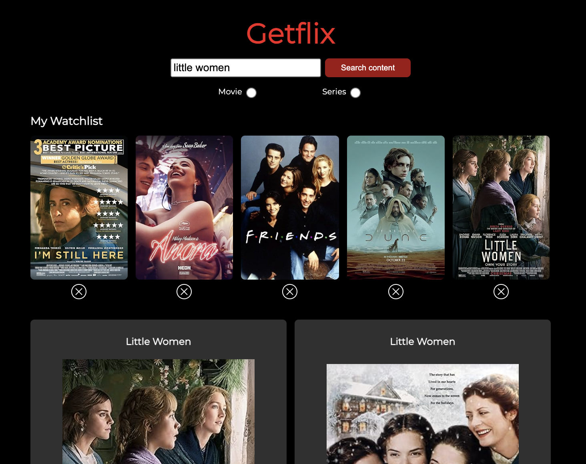

# 🎬 Getflix - Movie Search Application  

## 📌 Introduction  

Getflix is a **single-page application (SPA)** that allows users to search for **movies and series**, view detailed information, and save their favorite titles to a watchlist. The app is built with **React** and powered by the [OMDb API](https://www.omdbapi.com/) to provide an interactive and responsive user experience.  

## 🌍 Live Demo  

[👉 Click here to see Getflix live!](https://getflix.surge.sh/)


## 🚀 How to Use Getflix  



### 🔎 1. Search for Movies and Series  
- Enter a title in the search bar and select whether you want to find **movies** or **series**.  
- The app will display matching results, including the **title**, **poster**, and **release year**.  

### 🎭 2. View Title Details  
- Click on a movie or series **poster** to see more details, including:  
  - **Plot**  
  - **Year**
  - **Cast**  
  - **Awards**  
  - **Country**
  - **Director**  
  - **Runtime**  

### ❤️ 3. Save Titles to Your Watchlist  
- Click on the **heart icon** in a result card to add a movie or series to your personal watchlist.  
- The watchlist **persists across browser refreshes** so you can access your saved titles later.  

### 📱 4. Responsive Design  
- Getflix is designed to work smoothly on **mobile, tablet, and desktop** devices.  

---

## 📖 Table of Contents  
- [Project Setup](#project-setup)  
- [Technologies Used](#technologies-used)  
- [Features](#features)  

---

## ⚙️ Project Setup  

To set up Getflix locally, follow these steps:  

### 1️⃣ Clone the Repository  
```bash
git clone https://github.com/juliamazzoni/Getflix.git
cd Getflix
```

### 2️⃣ Install Dependencies  
```bash
npm install
```

### 3️⃣ Run the Application  
```bash
npm run dev
```
This will start the application at: **[http://localhost:5173/](http://localhost:5173/)**  

---

## 🛠️ Technologies Used  

- **React 19** – for building the user interface  
- **React Router** – for handling page navigation  
- **TypeScript** – for type safety and better development experience  
- **Styled-components** – for styling  
- **OMDb API** – for fetching movie and series data  

---

## ✨ Features  

✅ **Responsive UI** – Adapts to different screen sizes using **media queries** for a smooth experience on **mobile, tablet, and desktop**.  
✅ **Animated Result Cards** – Adds a dynamic feel to the UI.  
✅ **Search Functionality** – Users can search for **movies or series** with a type filter.  
✅ **Movie & Series Details** – Clicking on a title displays more details, such as **plot, director, runtime, and awards**.  
✅ **Persistent Watchlist** – Users can save their favorite titles, which **remain stored even after refreshing the browser**.  
